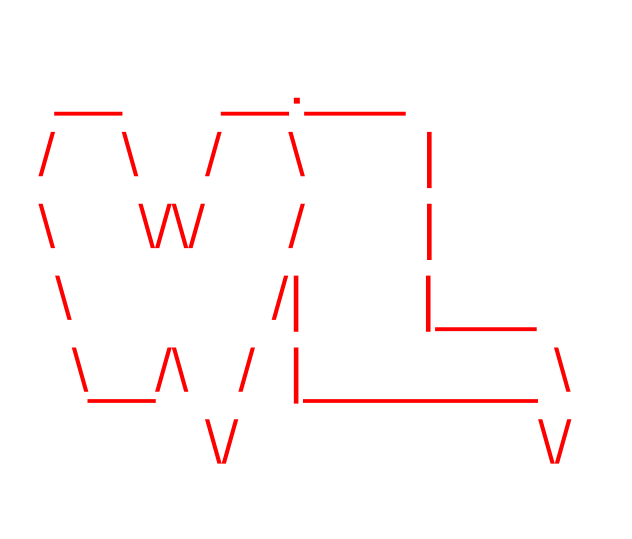

<p align="center">
	
	<h1 align="center"> WowList  </h1>
</p>

A wordlist generation wrapper.

## OS Requirements

WowList was developed for use with the following operating systems. Using others may not produce expected results.
```
- Kali Linux 6.12.13-amd64
```

## Software Requirements

WowList was developed for use with the following open-source softwares. Using other frameworks may not produce expected results.
```
- cewl 6.2.1-1
```

## Usage

This section will cover how to download and run the wowlist generator to your liking.

### Downloading

First, clone the repo:
```
git clone https://www.github.com/ntjennings1/wowlist.git $WOWLIST_HOME
```

Be sure to give the file execution permissions (with admin privileges):
```
sudo chmod 700 $WOWLIST_HOME -R
```

Next, enter the directory of the wowlist project:
```
cd $WOWLIST_HOME
```

### Running

Once inside the coned directory, users can enter the following script to use wowlist features:
```
./src/wowlist.sh
```

#### Parameters

Users must indicate valid parameters before obtaining a curated wordlist.

	[x] URL to grab words from
	[x] Minimum word length
	[x] Maximum crawl depth
	[x] Run duration

#### Example Run

This script will crawl YouTube for at most 10 layers, seek words with at least 6 letters, and last 10 seconds.
```
./$WOWLIST_HOME/src/wowlist.sh https://www.youtube.com 6 10 10
```

## Metrics

To evaluate run performance, enter the following command:
```
./$WOWLIST_HOME/src/eval.sh
```

## Acknowledgements

```
Noah Jennings
	ntjennings1@gmail.com
	Old Dominion University
```
